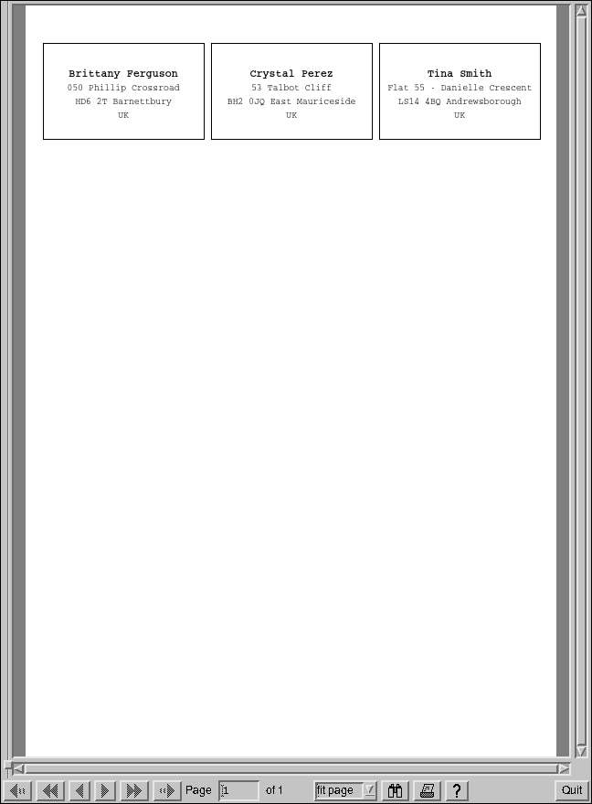

# Addresslabels
Quick Python script to create simple PDF with addresses to print on label sheets. Depends on reportlab.

Just run addresslabels.py after configuring it in `config` to turn a CSV file into a PDF document like shown in the image below.

```
Brittany Ferguson,050 Phillip Crossroad,HD6 2T,Barnettbury,UK
Crystal Perez,53 Talbot Cliff,BH2 0JQ,East Mauriceside,UK
Tina Smith,Flat 55 - Danielle Crescent,LS14 4BQ,Andrewsborough,UK
```



## Features
* supports custom fonts to embed into the PDF file, as long as you provide the `.afm` anf `.pfb` files for them in the designated fontdir
* supports any pagesize and unit that reportlab supports
* supports multipage PDF output
* horizontally centres every line and does good effort to vertically align the complete label as well
